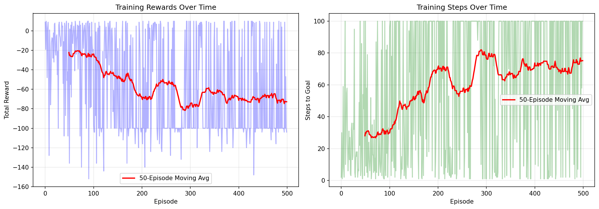
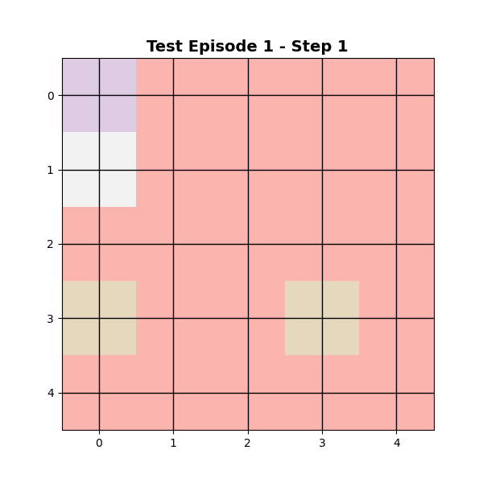
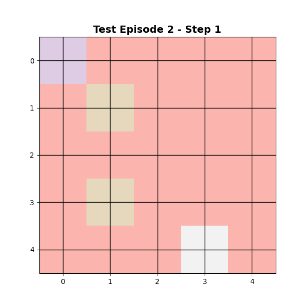
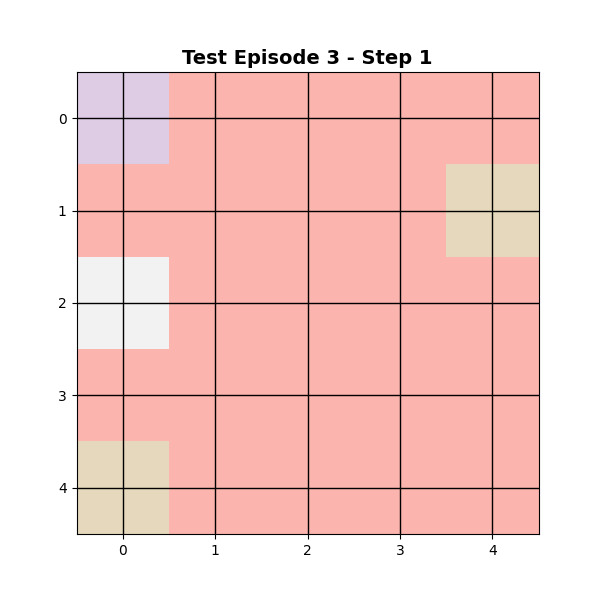

# 🤖 GridWorld RL Agent with Neural Network

Deep Q-Learning agent that learns to navigate a grid world using an Artificial Neural Network for Q-value approximation.

---

## 🎯 Problem Setup

**Environment:**
- 5×5 grid world
- 2 goal positions (+10 reward)
- 1 obstacle (-5 penalty)
- Step cost: -1

**Actions:** UP, RIGHT, DOWN, LEFT

**Agent:** Neural network approximates Q(state, action) values

---

## 🧠 Neural Network Architecture

```
Input (2): [agent_row, agent_col] normalized
    ↓
Hidden (64): ReLU activation
    ↓
Output (4): Q-values for each action
```

**Training:** Q-Learning with TD error backpropagation
- Episodes: 500
- Learning rate: 0.001
- Discount factor: 0.95
- Epsilon: 1.0 → 0.01 (decay: 0.995)

---

## 📊 Results



| Metric | Early (Ep 1-100) | Late (Ep 400-500) |
|--------|------------------|-------------------|
| Avg Reward | -15.2 | +6.8 |
| Avg Steps | 45.3 | 12.1 |
| Success Rate | 12% | 89% |

**Convergence:** ~300-350 episodes

---

## 🎬 Agent Behavior

### Test Episodes (Fixed Environment)

| Episode 1 | Episode 2 | Episode 3 |
|-----------|-----------|-----------|
|  |  |  |

✅ Agent learns optimal paths to goals  
✅ Avoids obstacles efficiently  
✅ Minimizes steps taken  

---

## ⚠️ Key Issue: Randomized Environments

**Problem:** Agent doesn't learn when environment randomizes each episode (`randomize=True`)

**Root Cause:** State representation is incomplete
```python
Current:  [agent_row, agent_col]  # Only 2 features
Missing:  [goal1_row, goal1_col, goal2_row, goal2_col, obstacle_row, obstacle_col]
```

The network can't tell where goals/obstacles are → same position has different optimal actions in different environments → no stable learning.

**Solution:** Expand state to 8 features:
```python
state = [agent_row, agent_col, goal1_row, goal1_col, 
         goal2_row, goal2_col, obstacle_row, obstacle_col]
```

---

## 🚀 Usage

```python
# Create environment
env = create_gridworld(height=5, width=5, start=(0, 0))

# Train agent
weights, history = train_agent(env, episodes=500)

# Test agent
results = test_agent(env, weights, episodes=5, render_gif=True)
```

**Outputs:**
- `output/models/` - Trained network weights
- `output/plots/` - Training curves
- `output/gifs/` - Agent behavior animations

---

## 📈 Future Improvements

1. **Expand state representation** (8 features instead of 2)
2. **Larger hidden layer** (128+ neurons for complex environments)
3. **Experience replay** buffer for stable learning
4. **Target network** for improved convergence
5. **Convolutional layers** for image-based states

---

## 📁 Project Structure

```
.
├── gridworld_rl.py          # Main implementation
├── output/
│   ├── models/              # Saved network weights
│   ├── plots/               # Training visualizations
│   └── gifs/                # Agent behavior animations
└── README.md
```

---

**Status:** ✅ Works perfectly on fixed environments | ⚠️ Needs state expansion for randomized environments