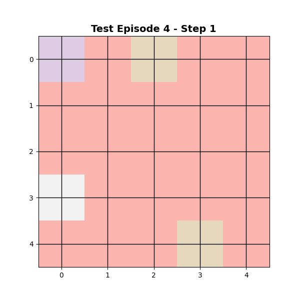
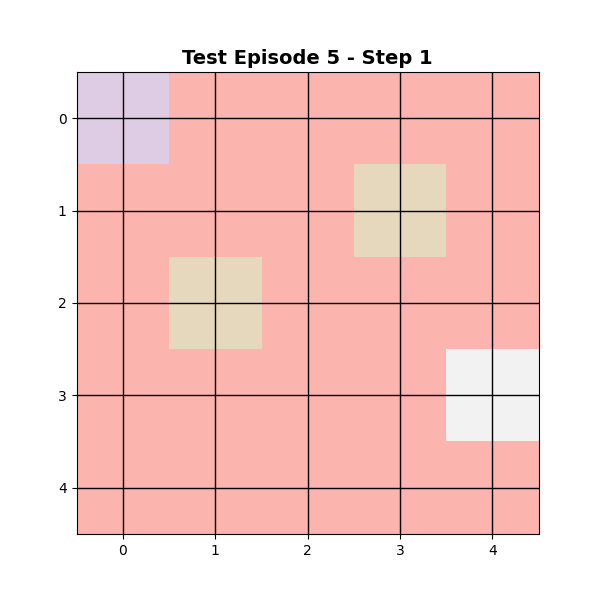

# 🤖 GridWorld RL Agent with Neural Network

ANN agent that learns to navigate a grid world using an Artificial Neural Network for Q-value approximation.

---

## 🎯 Problem Setup

**Environment:**
- 5×5 grid world
- 2 goal positions (+10 reward)
- 1 obstacle (-5 penalty)
- Step cost: -1

**Actions:** UP, RIGHT, DOWN, LEFT

**Agent:** Neural network approximates Q(state, action) values

---

## 🧠 Neural Network Architecture

```
Input (2): [agent_row, agent_col] normalized
    ↓
Hidden (64): ReLU activation
    ↓
Output (4): Q-values for each action
```

**Training:** Q-Learning with TD error backpropagation

---

## 📊 Training Results


---

## 🎬 Agent Behavior

### Test Episodes

| Episode 1 | Episode 2 | Episode 3 |
|-----------|-----------|-----------|
|  |  |  |

| Episode 4 | Episode 5 |
|-----------|-----------|
|  |  |

---

## ⚠️ Critical Issue: Agent Doesn't Move with Randomized Environments

**Problem:** When `randomize=True` is used during training/testing, the agent fails to learn and doesn't move intelligently.

### Root Cause: Incomplete State Representation

**Current state representation:**
```python
state = [agent_row, agent_col]  # Only 2 features
```

**The Problem:**
The neural network only knows WHERE the agent is, but has NO information about:
- Where the goals are located
- Where the obstacle is located

When the environment randomizes every episode:
- Position `(2, 3)` might have a goal to the RIGHT in Episode 1
- Position `(2, 3)` might have a goal to the LEFT in Episode 2
- Position `(2, 3)` might have an obstacle to the RIGHT in Episode 3

The network sees the same input `[2, 3]` but needs to output different Q-values depending on the environment configuration. **This is impossible without knowing where goals and obstacles are.**

### Why It Can't Learn

1. **No stable mapping**: Same state → different optimal actions (depending on environment)
2. **Catastrophic interference**: Learning Episode 2 "unlearns" Episode 1
3. **Random behavior**: Network outputs become meaningless averages

### Solution: Expand State Representation

**Fixed state (8 features):**
```python
state = [
    agent_row, agent_col,      # Where am I?
    goal1_row, goal1_col,      # Where is goal 1?
    goal2_row, goal2_col,      # Where is goal 2?
    obstacle_row, obstacle_col # Where is the obstacle?
]
```

Now the network has complete information and can learn: "If I'm at (2,3) and goal is at (2,5), move RIGHT"

---

## 🚀 Usage

```python
# Create environment
env = create_gridworld(height=5, width=5, start=(0, 0))

# Train agent (fixed environment)
weights, history = train_agent(env, episodes=500)

# Test agent
results = test_agent(env, weights, episodes=5, render_gif=True)
```

**Outputs:**
- `output/models/q_network.npz` - Trained network weights
- `output/plots/training_curves.png` - Training performance
- `output/gifs/test_episode_*.gif` - Agent behavior animations

---

## 📁 Project Structure

```
.
├── gridworld_rl.py          # Main implementation
├── output/
│   ├── models/              # Saved network weights
│   ├── plots/               # Training visualizations
│   └── gifs/                # Agent behavior animations
└── README.md
```