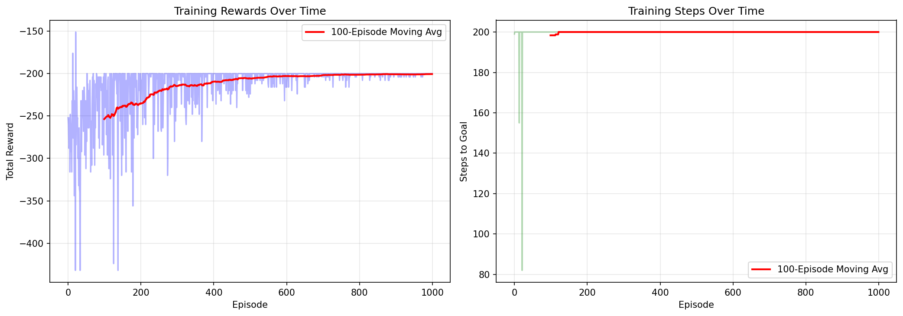
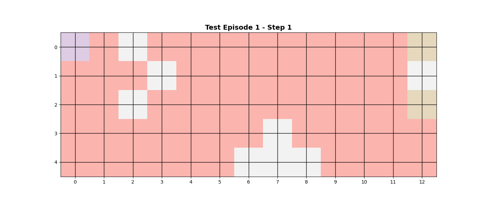
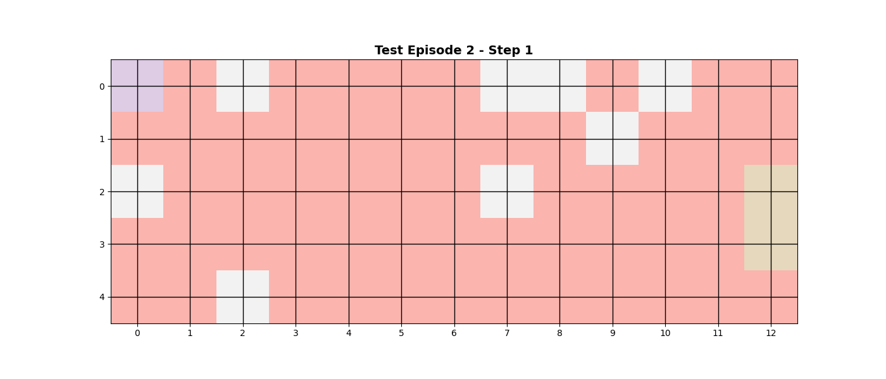
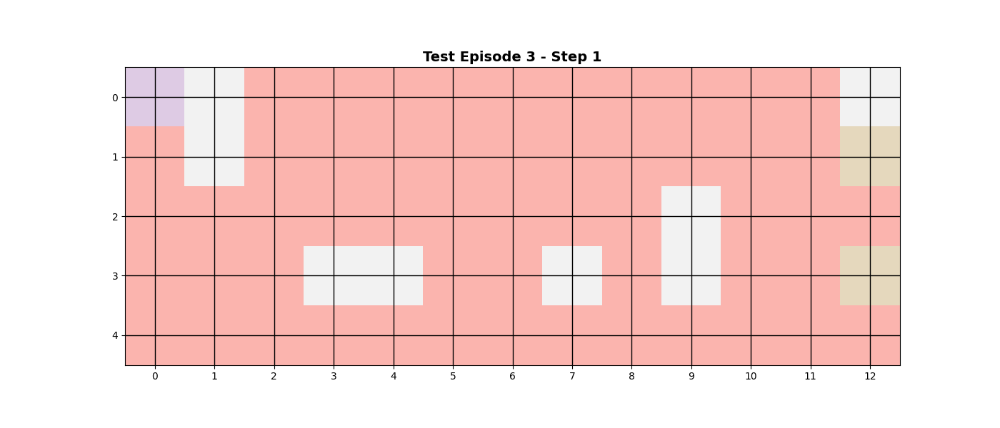
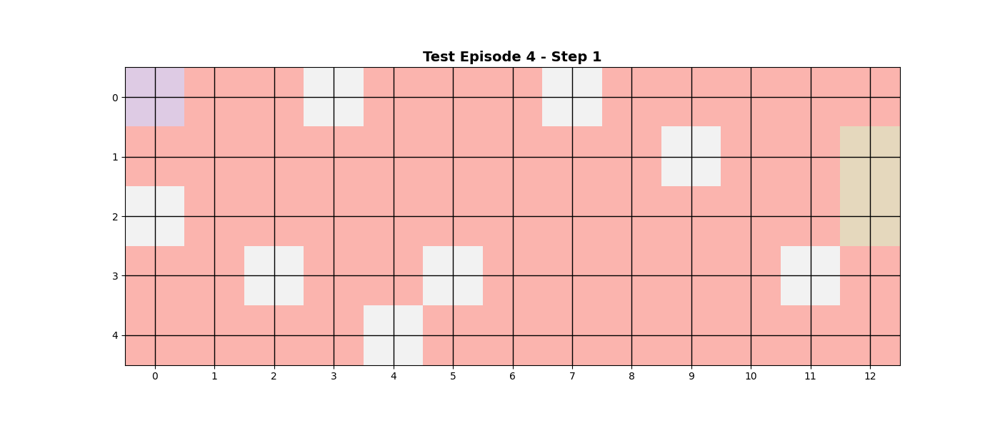
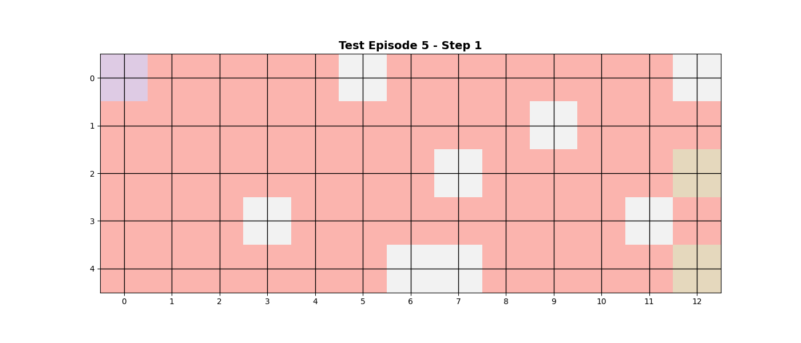

# 🤖 GridWorld RL Agent - 5×13 Grid with Multiple Obstacles

ANN agent navigating a challenging grid world with neural network Q-value approximation.

---

## 🎯 Environment Configuration

**Grid Dimensions:** 5 rows × 13 columns

**Key Features:**
- **Start Position:** Top-left corner (0, 0)
- **Goals:** 2 positions **always in the last column (column 12)**
  - Randomly placed in different rows
  - Reward: +10 each
- **Obstacles:** 8 randomly placed obstacles
  - Penalty: -5 for collision
  - Agent stays in place when hitting obstacle
- **Step Cost:** -1 (encourages efficient paths)

**Actions:** UP ⬆️ | RIGHT ➡️ | DOWN ⬇️ | LEFT ⬅️

---

## 🧠 Neural Network Architecture

```
Input (2): [agent_row/5, agent_col/13] normalized
    ↓
Hidden (128): ReLU activation
    ↓
Output (4): Q-values [Q(UP), Q(RIGHT), Q(DOWN), Q(LEFT)]
```

**Training Hyperparameters:**
- Episodes: 1000
- Max steps per episode: 200
- Learning rate: 0.001
- Discount factor (γ): 0.95
- Epsilon decay: 1.0 → 0.01

---

## 📊 Training Results



*Agent learns to navigate the longer grid and avoid multiple obstacles over 1000 episodes.*

---

## 🎬 Agent Navigation Examples

### Test Episode 1


### Test Episode 2


### Test Episode 3


### Test Episode 4


### Test Episode 5


---

## ⚠️ Key Challenge: Limited State Representation

**Current Implementation:**
```python
state = [agent_row, agent_col]  # Only 2 features
```

**The Problem:**
The agent only knows its current position but has **no information about**:
- Where the 2 goals are in the last column
- Where the 8 obstacles are located

**Why Fixed Environment Works:**
When the environment stays the same across all episodes:
- Position (2, 5) always has the same obstacles/goals nearby
- Network learns: "At (2, 5), moving RIGHT is good"
- Consistent state → action mapping enables learning

**Why Randomized Environment Fails:**
If we set `randomize=True`:
- Position (2, 5) has different obstacles/goals each episode
- Episode 1: Moving RIGHT is optimal (goal nearby)
- Episode 2: Moving RIGHT hits obstacle (different layout)
- Episode 3: Moving LEFT is optimal (new configuration)
- Network can't learn stable policy from position alone

**Solution for Generalization:**
Expand state to include environment information:
```python
state = [
    agent_row, agent_col,           # Where am I?
    goal1_row, goal2_row,           # Where are goals? (cols always 12)
    obs1_row, obs1_col,             # Where are obstacles?
    obs2_row, obs2_col,
    ... (all 8 obstacles)
]
# Total: 2 + 2 + 16 = 20 features
```

This gives the network complete information to make decisions regardless of environment configuration.

---

## 🚀 Usage

```python
# Create 5x13 environment with 8 obstacles
env = create_gridworld(height=5, width=13, start=(0, 0), num_obstacles=8)

# Train agent (fixed environment)
weights, history = train_agent(env, episodes=1000)

# Test agent
results = test_agent(env, weights, episodes=5, render_gif=True)
```

**Outputs:**
- `output/models/q_network.npz` - Trained weights
- `output/plots/training_curves.png` - Learning curves
- `output/gifs/test_episode_*.gif` - Agent behavior

---

## 📁 Project Structure

```
.
├── gridworld_rl.py
├── output/
│   ├── models/q_network.npz
│   ├── plots/training_curves.png
│   └── gifs/
│       ├── test_episode_1.gif
│       ├── test_episode_2.gif
│       ├── test_episode_3.gif
│       ├── test_episode_4.gif
│       └── test_episode_5.gif
└── README.md
```

---

## 🎯 Key Takeaway

**Current Status:** ✅ Agent successfully learns to navigate 5×13 grid with 8 obstacles to reach goals in the last column when environment is fixed.

**Limitation:** ⚠️ Cannot generalize to randomized environments without expanding state representation to include goal and obstacle positions.